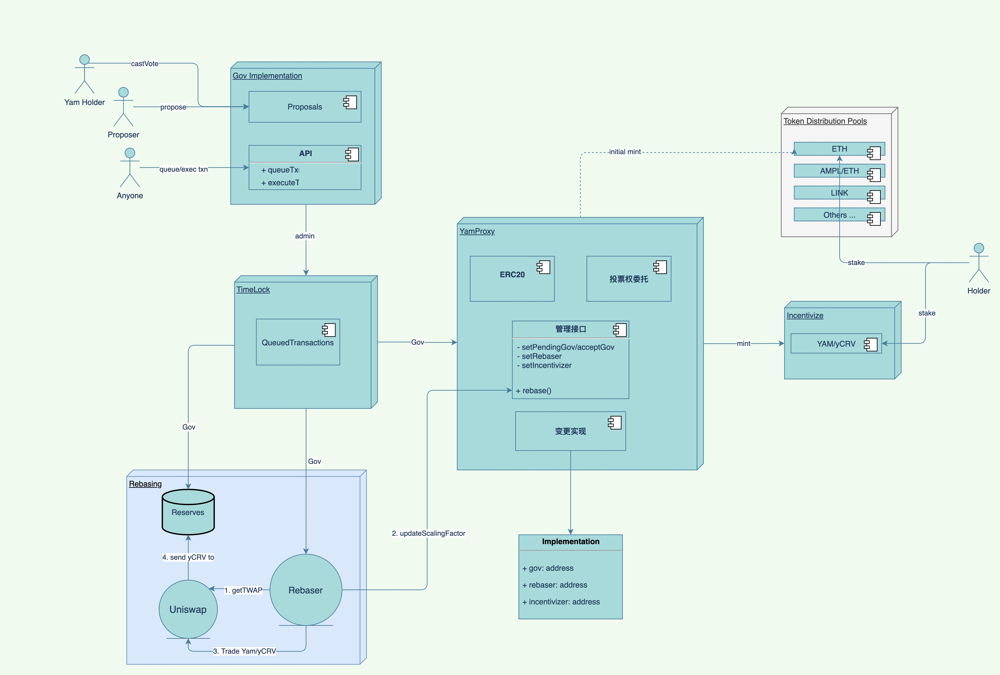

<!--
class: lead invert
-->

## How Yam Protocol works

---

### Yam Token

- Delegator Pattern.
- Only **Gov** can change underlying **implementation**.
- Only **Gov** can change **rebaser**, **incentivizer**.
- Only **Gov**, **Rebaser**, **Incentivizer** can `mint`.
- Only **Rebaser** can `rebase`.

---

### Initial Token Dispatch

- Several pools with equal yam tokens mint by gov during initialization.
- User stake their ETH to ETH pool, and get yam reword during the staking period.
- Last for 7 days.

---

### Gov

- GovImpl
  - store proposals from proposers.
  - Voters cast votes to proposals.
  - Once proposal is approved, everyone can queue the txns in the proposal to TimeLock.
  - Once the time has come, everyone can trigger the execution of queued txns.

---

### Rebase

- Get the rate of YAM/yCRV from Uniswap.
- based one the rate, change the scalingFactor

---

### Incentivize

- Another staking pool which users need to stake yam/yCRV LP tokens, and get yam token as reward.
- Half for every 7 days.